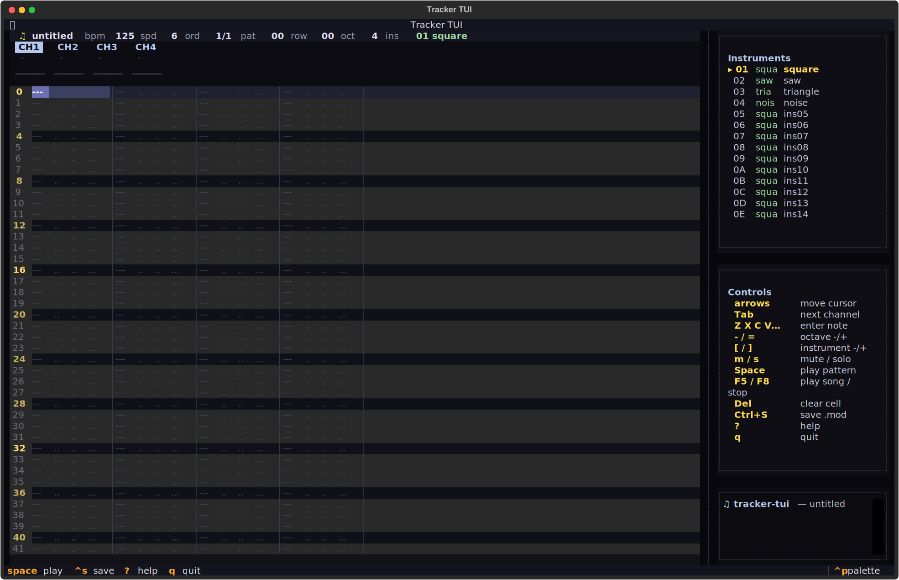
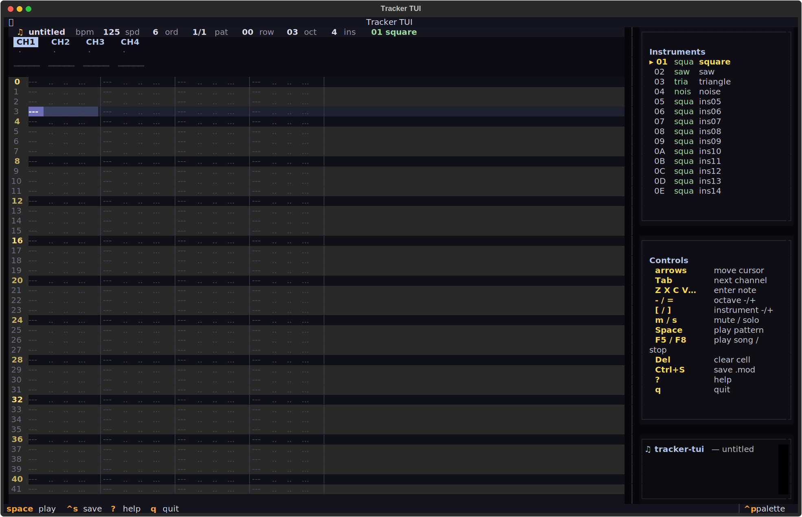

# tracker-tui
Four channels. Infinite tracks.




## About
A 4-channel Amiga-style chiptune tracker, in a terminal, with a pure-Python software synth driving sounddevice. Round-trip ProTracker .mod I/O. Per-channel meters, live pattern editing, sample management. Make music like it's 1987 and MOD files are still the future.

## Screenshots


## Install & Run
```bash
git clone https://github.com/akakabrian/tracker-tui
cd tracker-tui
make
make run
```

## Controls
<Add controls info from code or existing README>

## Testing
```bash
make test       # QA harness
make playtest   # scripted critical-path run
make perf       # performance baseline
```

## License
MIT

## Built with
- [Textual](https://textual.textualize.io/) — the TUI framework
- [tui-game-build](https://github.com/akakabrian/tui-foundry) — shared build process
